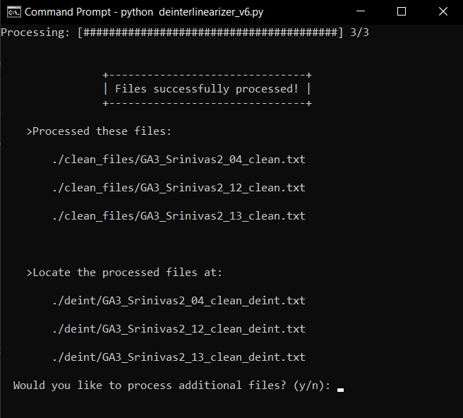

# **AANT**

**AANT** is a command-line utility for converting linguistic 
fieldnotes from a file of tri-linear, interlinear glosses to a format 
that can be imported to [**ELAN**](https://archive.mpi.nl/tla/elan/download) for automatic annotation of 
corresponding audio recordings.

## **Installation**

This Python script requires Python 3.7 or later. For Windows, this can be installed from [**here**](https://www.python.org/downloads/windows/). For OSx users, open a terminal and check your native python installation by running `python --version`. If it is older than 3.7, install the latest version [**here**](https://www.python.org/downloads/macos/).

Once the correct version of Python is installed, create a virtual environment using the following command.


### *Windows*
```bash
python -m venv venv
```

### *OSx*
```bash
python3 -m venv venv
```

No further installation is necessary. Just download **`deinterlinearizer_v6.py`**.

## **Usage**

The **AANT** can process files in two modes. **Default** mode and **Quick Process** mode.

<hr>

## *Default Mode:*

This mode runs the GUI and interactive elements of the **AANT**. (*Note*: Windows requires backslashes ( \\ ), while OSx requires slashes ( / ) for these commands)

### *Windows*
```bash
venv\Scripts\activate
python deinterlinearizer_v6.py
deactivate
```

### *OSx*
```bash
source venv/bin/activate
python3 deinterlinearizer_v6.py
deactivate
```

On startup, the splash page displays the logo, attributions, and a brief description of the purpose and functionality of the **AANT**.  
   

 
This mode also allows the user to redirect the **AANT** to another directory upon processing the initial batch of files.  



<hr>

## *Quick Process:*

This mode takes the target directory as a **third** argument and processes the files in that directory with no additional input needed.

Run it using the following command, substituting the path to the input directory for **[inputdir]**.

### *Windows*
```bash
venv\Scripts\activate
python deinterlinearizer_v6.py [inputDir]
deactivate
```

### *OSx*
```bash
source venv/bin/activate
python3 deinterlinearizer_v6.py [inputDir]
deactivate
```
## **Input**

Currently, **AANT** expects input in the form of a tab-delineated text file containing interlinear glossing. It expects that the file takes the following form:


```txt
#Title line
#Title line
PHONOLOGY   LINE
MORPHOSYNTAX    LINE
'ENGLISH GLOSS'
PHONOLOGY   LINE
MORPHOSYNTAX    LINE
'ENGLISH GLOSS'
...
```
Where **Title lines** are each prepended by a `#`, elements on the **PHONOLOGY** and **MORPHOSYNTAX** lines are tab-separated, and the **ENGLISH GLOSS** is surrounded by single quotes `'`.  
  
For example:

```txt
#kurutəl-pur
#kuru talpur .MOV
kun     ajəm=liŋ-an     tiʔne	bəŋsa	po
that	time=LOC-N.SFX	here	good	Q
'that place for the crops, at that time "is this one here good'
ir-bəŋsa	po	gam-le
NEG.NMLZR-good	Q	think-PST
'or is this one not good they would think'
```

## **Output**

After processing, **AANT** outputs a directory of files at the level of the working directory labeled `deinter`. Each file contains the contents of a single input file, separated by gloss type, one annotation item per line. 

For example, the file input given above would result in the following output:

```txt
kun
ajəm=liŋ-an
tiʔne
bəŋsa
po
ir-bəŋsa
po
gam-le
that
time=LOC-N.SFX
here
good
Q
NEG.NMLZR-good
Q
think-PST
'that place for the crops, at that time "is this one here good'
'or is this one not good they would think'
```

This file can then be imported into an ELAN file which has been prepared with the appropriate annotation tiers and blank time-aligned annotations.

## **License**
